# System Architecture Diagram

## High-Level Game Flow

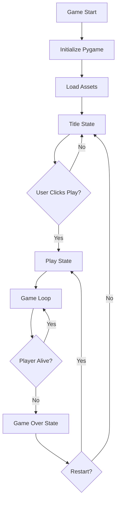

## Core Game Loop Architecture

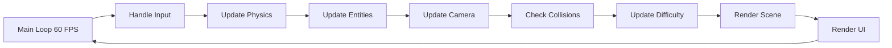

## Player State Machine

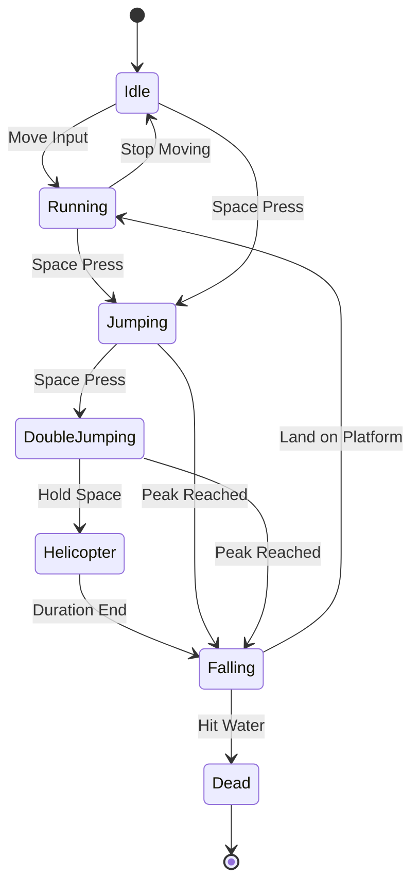

## Entity Relationship Diagram

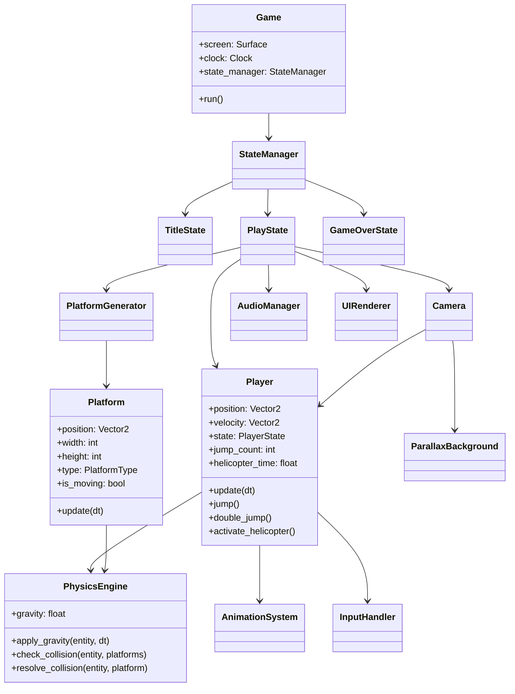

## Data Flow: Jump Mechanics

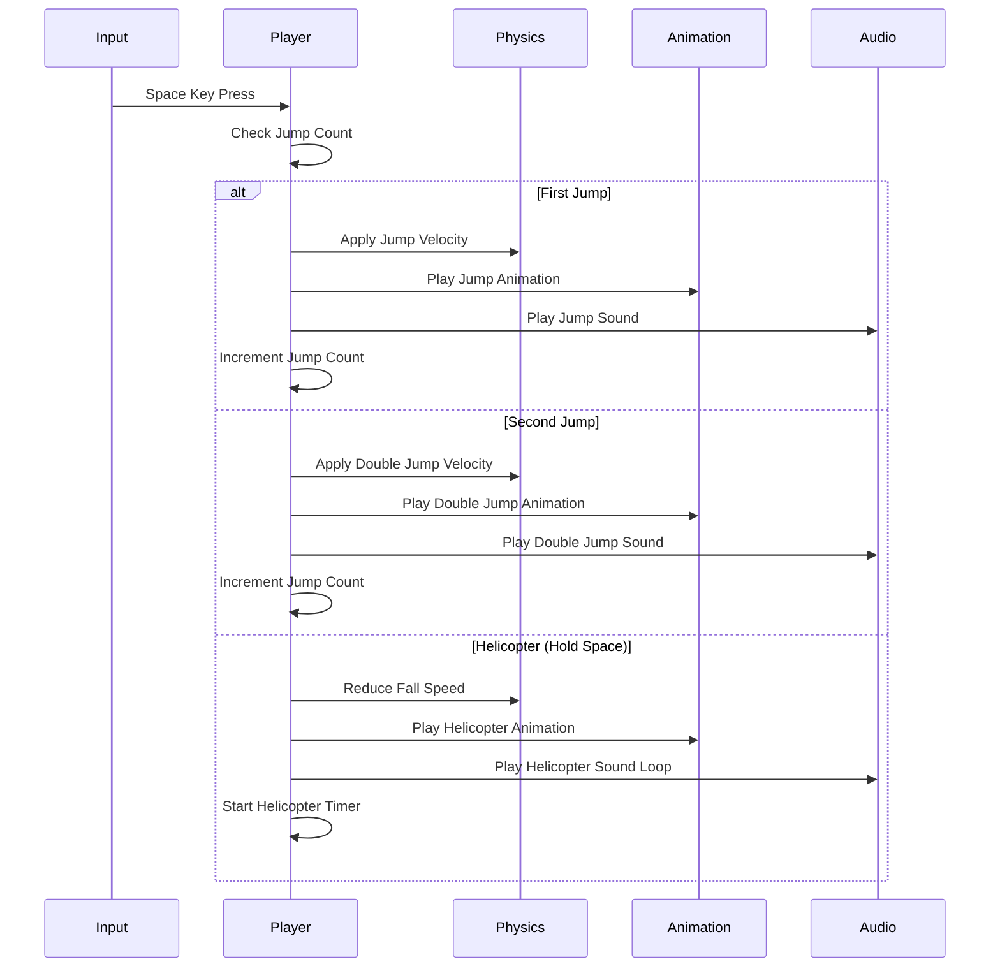

## Platform Generation System

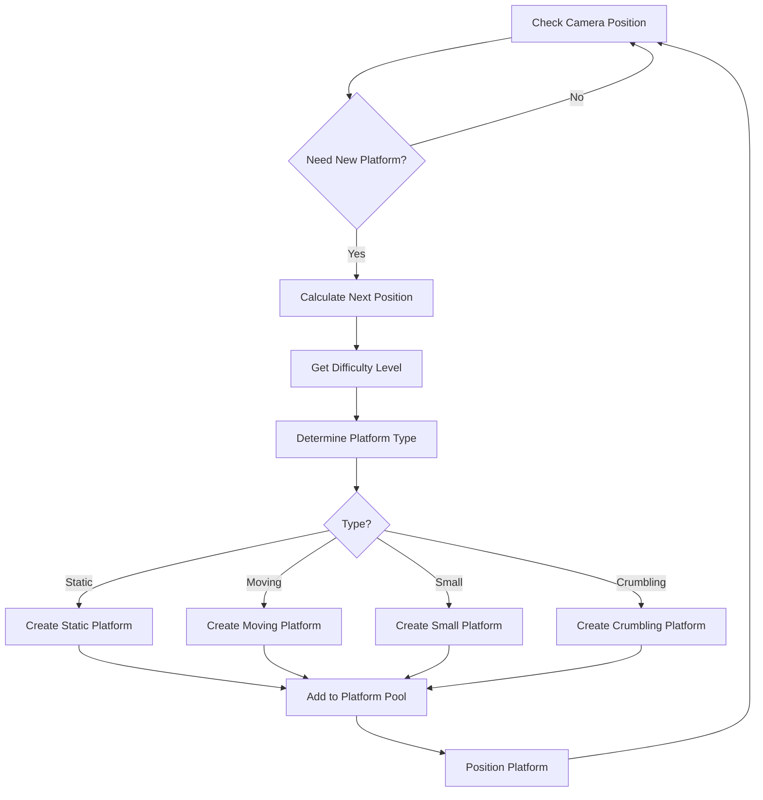

## Rendering Pipeline

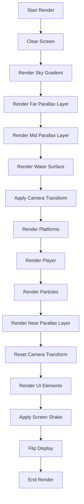

## Collision Detection Flow

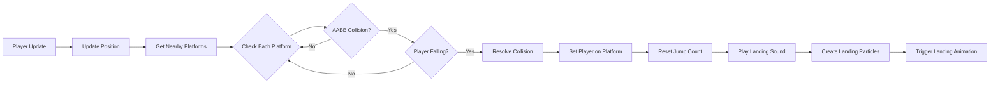

## Audio System Architecture

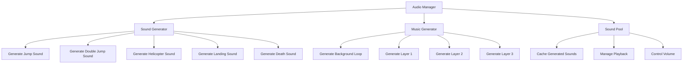

## Performance Optimization Strategy

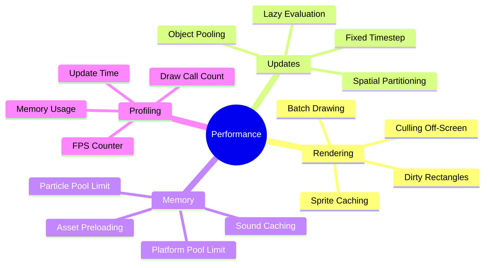

## Difficulty Progression System

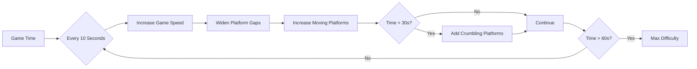

## Input Handling System

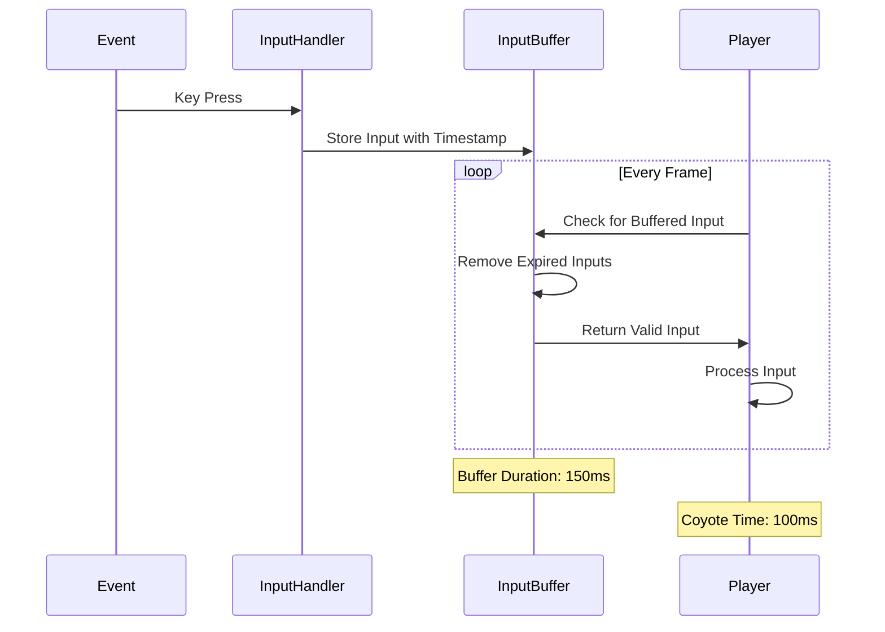

## Camera Smoothing Algorithm

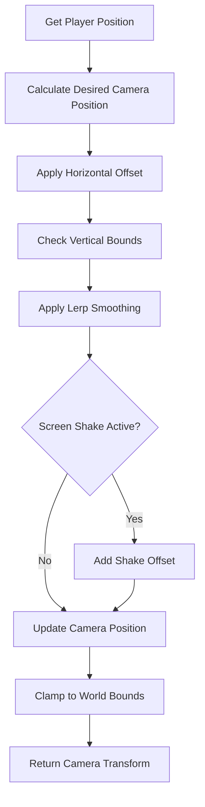

## Asset Generation Pipeline

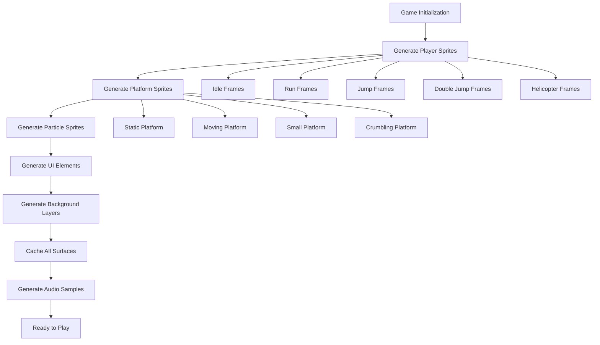

## Memory Management Strategy

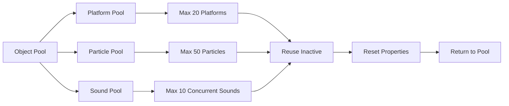

This diagram set provides a comprehensive visual overview of the game's architecture, showing how different systems interact and data flows through the application.